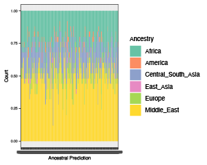

```{r setup knitr, include = FALSE}
knitr::opts_chunk$set(
  collapse = TRUE,
  comment = "#>"
)
```

## Running Random Forest Classification
_plinkQC_ predicts sample ancestry by applying a random forest trained on the principal components of cleaned genotype data from the 
[harmonized 1000 Genomes and Human Genome Diversity Project dataset](https://genome.cshlp.org/content/34/5/796).

For ancestry estimation, accessory functions from [Plink v2](https://www.cog-genomics.org/plink/2.0/) are needed, as are pre-computed
loading matrices for the PCA projection used in the model.
These are hosted on the _plinkQC_ github repo under the inst/extdata folder
located [here](https://github.com/meyer-lab-cshl/plinkQC/tree/ancestry_update/inst/extdata/load_mat). Alternatively, the whole github repo can downloaded with

```{bash installing github, eval=FALSE}
git clone git@github.com:meyer-lab-cshl/plinkQC.git
```


### Workflow
To begin with this is an example of how to run the classifier with a provided
test data set. We will set up a temporary directory for qcdir and name the variables. The name of the files (before the .acount or .eigenvec.allele) fo
the loading matrices must be included in the `path2load_mat` variable. 

```{r setting up, eval = FALSE}
package.dir <- find.package('plinkQC')
indir <- file.path(package.dir, 'extdata')
qcdir <- tempdir()
name <- 'data.hg38'
path2plink2 <- "/Users/syed/bin/plink2"
path2load_mat <- "path/to/load_mat/merged_chrs.postQC.train.pca"
```

Before use, the study data should be in the new hg38 annotation. USCS's [liftOver](https://genome.ucsc.edu/cgi-bin/hgLiftOver) tool may be needed to map variants from one annotation to another. More details on how to use the tool can
be found on the processing [HapMap III reference data vignette](HapMap.html).

In addition, the data should be in PLINK 2.0 format (i.e .pgen, .pvar, .psam
files),  and the variants identifiers should be formatted according to this
example: 1:12345[hg38]. We can use the _plinkQC_ functions `convert_to_plink2()`
and `rename_variant_identifiers()` to correctly format genotype data that is
already in the hg38 annotation. 

``` {R, eval = FALSE}
convert_to_plink2(indir=indir, qcdir=qcdir, name=name, 
                  path2plink2 = path2plink2)
rename_variant_identifiers(indir=qcdir, qcdir=qcdir, name=name, 
                           path2plink2 = path2plink2)
name <- paste0(name, ".renamed")
```

After correctly formatting the variants, we can use the provided function to
return the predicted ancestry. Because the example dataset only has xx SNPS to
pass CRAN requirements, the overlap with the reference dataset is only xx %, thus additional noise is expected and visible in the plot below.

``` {R ancestry identification, eval = FALSE}
ancestries <- superpop_classification(indir=qcdir, qcdir=qcdir, name=name, 
                                      path2plink2 = path2plink2, 
                                      path2load_mat = path2load_mat) 
ancestries$p_ancestry
```

```{r load ancestry, out.width = "500px", echo=FALSE}
#| fig.alt: >
#|   Bar graph showing predicted ancestry fractions 
par(mfrow=c(2,1), las=1)

```

## Training Your Own Random Forest Classifier 
For non-human genotype data, there might still be the need to detect and predict population structure. In addition, in some rare cases, there might not be a
large enough overlap in the SNP genotypes and the trained reference data (we 
recommend > 5% overlap). In this case, we recommend training your own random
forest classifier. In the following, we will demonstrate the workflow for
setting up this training, starting with reference data download. As an example,
we show the process for the 1000 genomes dataset. The download and pre-processing are described in detail in [Processing 1000 Genomes reference data for ancestry estimation](Genomes1000.html). We will use a test study dataset included in the package as an example for the workflow.  

### Setting up Bash Script Variables
``` {bash setting up bash, eval = FALSE}
qcdir='~/qcdir'
name='data.hg38'
refdir=~/reference

mkdir -r $qcdir/plink_log
```

### Putting study data in qcdir
Copy your study dataset to the qcdir folder. In this example, we are assuming
that the provided test dataset included with the package has been moved. 

### Download reference data
A suitable reference dataset should be downloaded and if necessary, re-formated
into PLINK format. Vignettes
['Processing HapMap III reference data for ancestry estimation'](https://meyer-lab-cshl.github.io/plinkQC/articles/HapMap.html) and 
['Processing 1000Genomes  reference data for ancestry estimation'](https://meyer-lab-cshl.github.io/plinkQC/articles/Genomes1000.html),
show the download and processing of the HapMap phase III and 1000Genomes phase
III dataset, respectively. In this example, we will use the 1000Genomes data as
the reference dataset. We recommend using ```check_relatedness``` on the
reference to filter our related samples. This prevents data leakage between the training and testing datasets. 

### Set-up
We will first set up some bash variables and create directories needed; storing
the names and directories of the reference and study will make it easy to use 
updated versions of the reference or new datasets in the future. We create a 
directory named 'qcdir' for the study data. In order to keep the data directory tidy, we will create a directory for the log files and move them to the log directory for future reference after each analysis step. 

Once you have created 'qcdir', be sure to copy the data.bim, data.bed, 
and data.fam files into your directory. 

```{bash setup, eval=FALSE}
qcdir=~/qcdir
refdir=~/reference
name='data'
refname='all_hg38'

mkdir -p $qcdir/plink_log
```

### Match study genotypes and reference data
In order to compute joint principal components of the reference and study
population, we will need to combine the two datasets. The plink --merge function enables this merge, but requires the variants in the datasets to be matching by chromosome, position and alleles. The following sections show how to extract the relevant data from the reference and study dataset and how to filter matching variants.

### Filter reference and study data for non A-T or G-C SNPs
We will use an awk script to find non-A/T and non-G/C SNPs, as these SNPs are
more difficult to align, and remove them from both the reference and study data sets. In addition, we will only keep the autosomes (chr 1-22), only keep snps (snps-only), of those, keep only the biallelic ones (max-alleles 2), and remove
any duplicates (rm-dup). The data should start off in Plink 1.9 data format.

```{bash filter at and gc snps, eval=FALSE}
awk 'BEGIN {OFS="\t"}  ($5$6 == "GC" || $5$6 == "CG" \
                        || $5$6 == "AT" || $5$6 == "TA")  {print $2}' \
    $qcdir/$name.bim  > \
    $qcdir/$name.ac_gt_snps
awk 'BEGIN {OFS="\t"}  ($5$6 == "GC" || $5$6 == "CG" \
                        || $5$6 == "AT" || $5$6 == "TA")  {print $2}' \
    $refdir/$refname.bim  > \
    $qcdir/$refname.ac_gt_snps
   
plink2 --bfile  $refdir/$refname \
      --rm-dup exclude-all \
      --max-alleles 2 \
      --snps-only just-acgt \
      --exclude $qcdir/$refname.ac_gt_snps \
      --chr 1-22 \
      --make-bed \
      --out $qcdir/$refname.no_ac_gt_snps
mv  $qcdir/$refname.no_ac_gt_snps.log $qcdir/plink_log/$refname.no_ac_gt_snps.log

plink2 --bfile  $qcdir/$name \
      --rm-dup exclude-all \
      --max-alleles 2 \
      --snps-only just-acgt \
      --exclude $qcdir/$name.ac_gt_snps \
      --make-bed \
      --chr 1-22 \
      --allow-extra-chr \
      --out $qcdir/$name.no_ac_gt_snps
mv  $qcdir/$name.no_ac_gt_snps.log $qcdir/plink_log/$name.no_ac_gt_snps.log
```

### Renaming variant identifiers
Variant identifiers can vary between studies. To ensure that the data can be properly processed, we will rename the variant identifiers to a common scheme
based on chromosome number and basepair location by using _plinkQC_'s `rename_variant_identifiers` function.
``` {R renaming, eval = FALSE}
library(plinkQC)
name <- "data.no_ac_gt_snps"
refname <- "all_hg38.no_ac_gt_snps"
path2plink2 <- "/Users/syed/bin/plink2"
rename_variant_identifiers(indir=qcdir, qcdir=qcdir, name=name, 
                           path2plink2 = path2plink2)
```

### Filtering out shared SNPs between study and reference dataset
```{bash filter study SNPs, eval=FALSE}
cd $qcdir
awk '{print $3}' $name.renamed.pvar > $name.renamed.varids.txt

plink2 --pfile $refname.renamed --extract $name.renamed.varids.txt --make-bed --out $refname.renamed.studysnps
```

### Conducting markerQC, pruning LD, and individual QC
After filtering for SNPS shared in the study, we will conduct marker and sample quality control on the reference dataset. This is to ensure only robust data is
used as a reference. To reduce correlations between SNPs, we will prune for
variants in linkage disequilibrium (LD) after removing low quality markers. 
This is done with _plinkQC_'s pruning_ld() function. As part of the function,
ranges of known high-LD are excluded. These ranges are originally provided by @Anderson2010. 

```{R marker_sample_QC, eval=FALSE}
refname <- "all_hg38.renamed.studysnps"

fail_markers <- perMarkerQC(indir=indir, qcdir=qcdir, name=name,
                            path2plink=path2plink,
                            verbose=TRUE, interactive=TRUE,
                            showPlinkOutput=FALSE)
marker_ids <- cleanData(indir = indir, qcdir = qcdir, name = name, 
				path2plink = path2plink, filterAncestry = FALSE, filterRelated = FALSE, macTh = NULL, mafTh = 0.05, verbose = TRUE,
				filterSex = FALSE, filterHeterozygosity = FALSE, 
				filterSNPMissingness = TRUE, filterSampleMissingness = FALSE, 
				filterMAF = TRUE, filterHWE = TRUE)
name = paste(name, ".clean", sep = "")

pruning_ld(indir = indir, qcdir = qcdir, name = name, 
	  path2plink = path2plink, genomebuild="hg38")
name = paste(name, ".pruned", sep = "")

fail_samples <- perIndividualQC(indir=indir, qcdir=qcdir, name=name, dont.check_sex = TRUE,
								dont.check_relatedness = TRUE, 
                            path2plink=path2plink, dont.check_ancestry = TRUE,
                            interactive=TRUE, verbose=TRUE)

sample_ids <- cleanData(indir = indir, qcdir = qcdir, name = name, 
			 path2plink = path2plink, filterAncestry = FALSE, filterRelated = FALSE,verbose = TRUE,
			filterSex = FALSE, filterHeterozygosity = TRUE, 
			filterSNPMissingness = FALSE, filterSampleMissingness = TRUE, 
			filterMAF = FALSE, filterHWE = FALSE)
```

### PCA
After conducting quality control, we will compute the joint principal
components. 
``` {bash pca reference, eval=FALSE}
plink2 --bfile  $refname.renamed.studysnps.cleaned.pruned.cleaned \
       --nonfounders \
       --freq counts \
       --pca allele-wts 20 \
       --out $refname.renamed.studysnps.cleaned.pruned.cleaned.pca
       
mv $qcdir/$refname.renamed.studysnps.cleaned.pruned.cleaned.pca $qcdir/plink_log
```

After running a PCA, we will project the original dataset onto the principal components to rescale. This ensures that future projections will be on the same scale.
``` {bash project, eval=FALSE}
plink2 --pfile $refname.renamed.studysnps.cleaned.pruned.cleaned
       --read-freq $refname.renamed.studysnps.cleaned.pruned.cleaned.pca.acount 
       --score $refname.renamed.studysnps.cleaned.pruned.cleaned.pca.eigenvec.allele 2 6 header-read no-mean-imputation variance-standardize 
       --score-col-nums 7-26 --out $refname.renamed.studysnps.cleaned.pruned.cleaned.projection
```

### Training a random forest classifier in R
The principal components of the reference dataset will be used to train the
random forest algorithm in R. 
```{r, eval = FALSE}
library(tidyverse)
library(randomForest)

filepath <- 'insert path to sscore file here'
proj <- read.csv(
  file= filepath,
  sep='\t', header = TRUE)

package.dir <- find.package('plinkQC')
ancestry_info <- 
  read_delim(file.path(package.dir,"extdata/Genomes1000_ID2Pop.txt"))
superpop <- 
  read_delim(file.path(package.dir,"extdata/AncestryGeoLocations.csv"))
```

We divide up the data into a 70% training portion and 30% testing portion. To
ensure a balanced model, we will sample the data to ensure an even
representation of each ancestral superpopulation group in the testing portion of
the data. The number of inidividuals from each group that is chosen will have to adjusted for the size of the reference dataset. For the 1000 genomes dataset, we
use 448 samples in each of the five ancestral groups for a roughly 70% of the
data. 
``` {r, eval = FALSE}
proj <- proj %>%
  select(-c(ALLELE_CT, NAMED_ALLELE_DOSAGE_SUM))
colnames(proj) <- c("IID", paste0("PC", 1:20))

labeled_proj <- merge(proj, superpop)

n_individuals <- 448
set.seed(123)
idx <- split(seq(nrow(labeled_proj)), labeled_proj$Ancestry)

train.ids <- lapply(idx, function(i) {
  sample(i, n_individuals)
})

ids_to_keeps<- unlist(train.ids, use.names = FALSE, recursive = FALSE)
train_proj_1000g <- labeled_proj[ids_to_keeps,]
```

Then, we can train the random forest. We are providing a starting value for the parameter but we recommend utilizing a grid search (described in detail more
below) to determine the optimal values. 
```{r, eval = FALSE}
train_proj_1000g$Ancestry <- factor(train_proj_1000g$Ancestry)

ancestry_rf <- randomForest(Ancestry ~ .,
                        data = train_proj_1000g[,-c(2,23)], 
                        method = "rf", 
                        ntree = 750,
                        importance = TRUE)
ancestry_rf
```

### Predicting ancestries of new study data
To predict the ancestries of a new study dataset with our trained random forest, 
you need to project the newdata onto the principal components of the reference dataset. This is done with the --score function in plink2. The projection is
then used as input for the random forest. 
```{bash project newdata, eval=FALSE}
plink2 --pfile newdata 
       --read-freq all_hg38.pca.acount 
       --score all_hg38.pca.eigenvec.allele 2 6 header-read no-mean-imputation variance-standardize 
       --score-col-nums 7-26 --out newdata.projection
```

Then, we can use the random forest to predict the ancestry of the new data. 
```{r, eval = FALSE}
filepath <- "Insert path to newdata.sscore here"
newdata <- read.csv(
  file= filepath, 
  sep='\t', header = TRUE)

newdata <- newdata %>%
  select(-c(ALLELE_CT, NAMED_ALLELE_DOSAGE_SUM))
colnames(newdata) <- c("ID", paste0("PC", 1:20))

predictions <- predict(ancestry_rf, newdata)
```

### Evalulating and Tuning Classification
To evaluate the accuracy of the model, a commonly used metric is the out-of-bag 
(OOB) error rate and confusion matrix. The confusion matrix displays the number
of correct classifications for each ancestry along the diagonal. Any values
outside the diagonal are misclassifications for other ancestries. A summary of
these metrics can be seen through:
``` {R, eval = FALSE}
ancestry_rf
```
And we can visualize the confusion matrix as a heatmap.
```{r, eval = FALSE}
my_rf <- ancestry_rf$confusion
heatmap(my_rf[,-c(27)], scale = 'column', trace = 'none')
```

### Parameter Tuning via Grid Search 
There are different optimization techniques to determine the parameters for a
random forest. A simple one to implement is a grid-search where models with different parameters are initialized. Based on their performance, the optimal parameters can be determined. The parameters tested in our grid search are the
number of principal components included and the number of trees. Within the parameter values of the number of principal components and number of trees, cross-validation is done to determine the mtry variable. 

```{r, eval = FALSE}
train_results <- data.frame(mtry = c(0), ntrees = c(0), num_pc = c(0), acc = c(0))
train_proj_noids <- train_proj_1000g[,-c(1)]
for (PC_inc in c(1:20)) {
  for (ntree in c(1, 5)) {
    set.seed(123)
    fit <- train(Pop~., data=train_proj_noids[,c(1:PC_inc,21)], 
                 method="rf", metric="Accuracy",
                 trControl=control, ntree=ntree)
    train_proj_1000g <- rbind(train_proj_1000g, 
                     data.frame(mtry = fit$results$mtry, 
                                ntrees = rep(ntree, nrow(fit$results)),
                                num_pc = rep(PC_inc, nrow(fit$results)),
                                acc = fit$results$Accuracy))
  }
}
```

### Evaluating/Interpretting the RF
Once you have found a successful OOB error rate, you can use the below package
to find out important information regarding your tree. The below documentation 
builds a decision tree using categorical aspects to classify the data. The PC 
values for each sample are provided in our 1000 Genomes reference dataset file, 
where each sample has values for 20 distinct PCs. We ask if a certain sample's
value for a specific PC is less than or greater than a given number. Based on
that answer, it is either classified as a specific ancestry or needs to undergo
more investigation to classify it correctly. The visualization below is only
a subset of a decision tree the random forest builds as classifying all 26 
ancestries builds quite a complicated and cluttered plot. 
```{r, eval = FALSE}
# This is a visual of the random forest being made. 
# https://github.com/araastat/reprtree
reprtree:::plot.getTree(rf_mtry)
# Two different plots 
reprtree:::plot.getTree(rf_mtry, k=1, d=5) 
reprtree:::plot.getTree(rf_mtry, k=1, d=6) 
```

## References