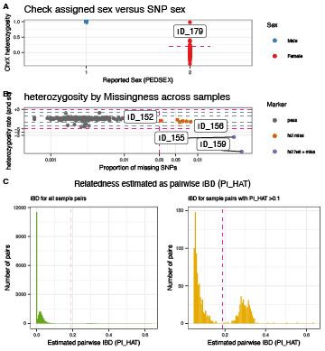
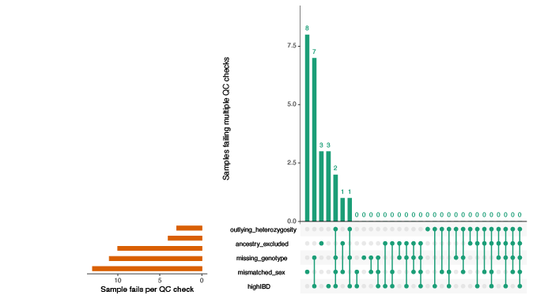
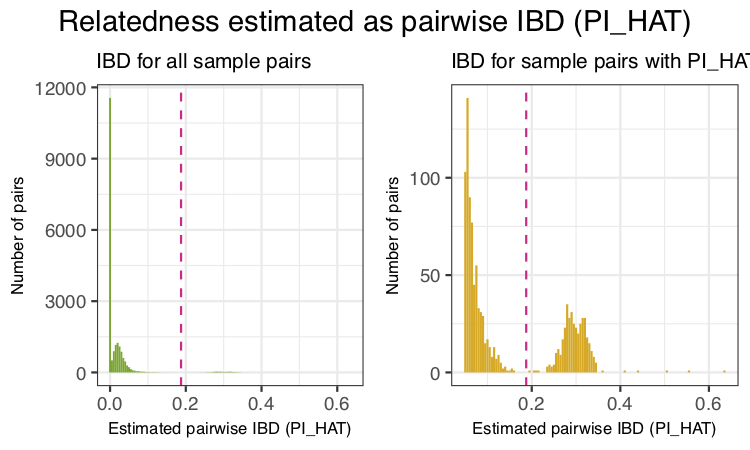
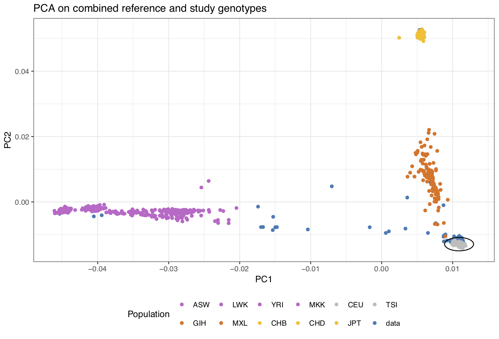
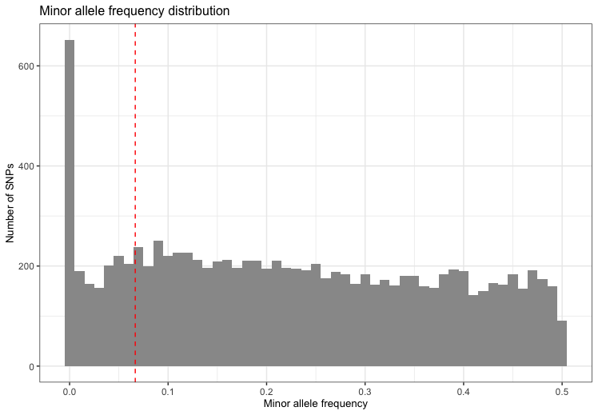

```{r setup, include = FALSE}
library(plinkQC)
knitr::opts_chunk$set(
  collapse = TRUE,
  comment = "#>"
)
```

# Introduction
Genotyping arrays enable the direct measurement of an individuals genotype at
thousands of markers. Subsequent analyses such as genome-wide association
studies rely on the high quality of these marker genotypes.

Anderson and colleagues introduced a protocol for data quality control in
genetic association studies heavily based on the summary statistics and
relatedness estimation functions in the PLINK software [@Anderson2010]. PLINK is
a comprehensive, open-source command-line tool for genome-wide association
studies (GWAS) and population genetics research [@Purcell2007, @Chang2015]. It's
main functionalities include data management, computing individual- and marker-
level summary statistics, identity-by-state estimation and association analysis.  
Integration with R is achieved through its R plugin or PLINK/SEQ R Package
[@PlinkSeq2014]. While the plugin is limited to operations yielding simple
genetic marker vectors as output, the PLINK/SEQ R Package is limited in the
functionalities it can access. 

*plinkQC* facilitates genotype quality control for genetic association studies
as described by [@Anderson2010]. It wraps 
around plink basic statistics (e.g. missing genotyping rates per individual, 
allele frequencies per genetic marker) and relationship functions and generates
a per-individual and per-marker quality control report. Individuals and markers
that fail the quality control can subsequently be removed with *plinkQC* to
generate a new, clean dataset. Removal of individuals based on relationship
status is optimised to retain as many individuals as possible in the study.

*plinkQC* depends on the [PLINK](https://www.cog-genomics.org/plink/1.9/) 
 (version $\ge$  1.9), which has to be manually installed prior to the usage of
 *plinkQC*. It assumes the genotype have already been determined from the
 original probe intensity data of the genotype array and is available in
[plink format](https://www.cog-genomics.org/plink/1.9/input#bed). 

The protocol is implemented in three main functions, the per-individual quality
control (`perIndividualQC`), the per-marker quality control (`perMarkerQC`) and
the generation of the new, quality control dataset (`cleanData`):

## Per-individual quality control
The per-individual quality control with `perIndividualQC` wraps around these
functions:
    (i) `check_sex`: for the identification of individuals with discordant sex
    information,
    (ii) `check_heterozygosity_and_missingness`: for the identification of
    individuals with outlying missing genotype and/or heterozygosity rates,
    (iii) `check_relatedness`: for the identification of related individuals,
    (iv) `check_ancestry`: identification of individuals of divergent ancestry.

## Per-marker quality control
The per-marker quality control with `perMarkerQC` wraps around these
functions:
    (i) `check_snp_missingnes`: for the identifying markers with excessive
    missing genotype rates,
    (ii) `check_hwe`: for the identifying markers showing a significant
    deviation from Hardy-Weinberg equilibrium (HWE),
    (iii) `check_maf`: for the removal of markers with low minor allele
    frequency (MAF).
    
## Clean data
`cleanData` takes the results of `perMarkerQC` and `perIndividualQC` and creates
a new dataset with all individuals and markers that passed the quality control
checks.

# Workflow
In the following, genotype quality control with *plinkQC* is applied on a small
example dataset with 200 individuals and 10,000 markers (provided with this
package). The  quality control is demonstrated in three easy steps,
per-individual and per-marker quality control followed by the generation of the
new dataset. In addition, the functionality of each of the functions underlying
`perMarkerQC` and `perIndividualQC` is demonstrated at the end of this vignette.

```{r set parameters}
package.dir <- find.package('plinkQC')
indir <- file.path(package.dir, 'extdata')
qcdir <- tempdir()
name <- 'data'
path2plink <- "/Users/hannah/bin/plink"
```

## Per-individual quality control
For `perIndividualQC`, one simply specifies the directory where the data is
stored (qcdir) and the prefix of the plink files (i.e. prefix.bim, prefix.bed,
prefix.fam). In addition, the names of the files containing information about 
the reference population and the merged dataset used in `check_ancestry` have to
be provided: refSamplesFile, refColorsFile and prefixMergedDataset. Per default, 
all quality control checks will be conducted. 

In addition to running each check, `perIndividualQC` writes a list of all fail
individual IDs to the qcdir. These IDs will be removed in the computation of the
`perMarkerQC`. If the list is not present, `perMarkerQC` will send a message
about conducting the quality control on the entire dataset.

`perIndividualQC` displays the results of the quality control steps in a
multi-panel plot. NB: To reduce the data size of the example data in plinkQC,
data.genome  has already been reduced to the individuals that are related. Thus
the relatedness plots in C only show counts for related individuals.

```{r individual QC,  eval=FALSE, fig.height=12, fig.width=9}
fail_individuals <- perIndividualQC(indir=indir, qcdir=qcdir, name=name,
                            refSamplesFile=paste(indir, "/HapMap_ID2Pop.txt",
                                                 sep=""), 
                            refColorsFile=paste(indir, "/HapMap_PopColors.txt",
                                                 sep=""),
                            prefixMergedDataset="data.HapMapIII",
                            path2plink=path2plink, do.run_check_ancestry = FALSE,
                            interactive=TRUE, verbose=TRUE)

```
```{r load individualQC, echo=FALSE, fig.height=12, fig.width=9, fig.align='center'}
par(mfrow=c(2,1), las=1)

```


`overviewperIndividualQC` depicts overview plots of quality control failures and
the intersection of quality control failures with ancestry exclusion.
```{r overview individual QC, eval=FALSE}
overview_individuals <- overviewPerIndividualQC(fail_individuals,
                                                interactive=TRUE)
```
```{r load overviewIndividualQC, echo=FALSE}
par(mfrow=c(2,1), las=1)

knitr::include_graphics("overviewAncestryQC.png")
```


## Per-marker quality control
`perMarkerQC` applies its checks to data in the specified directory (qcdir),
starting with the specified prefix of the plink files (i.e. prefix.bim,
prefix.bed, prefix.fam). Optionally, the user can specify different thresholds
for the quality control checks and which check to conduct. Per default, all
quality control checks will be conducted. `perMarkerQC` displays the results of
the QC step in a multi-panel plot.
```{r marker QC, eval=FALSE}
fail_markers <- perMarkerQC(indir=indir, qcdir=qcdir, name=name,
                            path2plink=path2plink,
                            verbose=TRUE, interactive=TRUE,
                            showPlinkOutput=FALSE)
```

```{r load markerQC, echo=FALSE, fig.height=9, fig.width=6, fig.align='center'}
par(mfrow=c(2,1), las=1)
knitr::include_graphics("markerQC.png")
```

`overviewPerMarkerQC` depicts an overview of the marker quality control
failures and their overlaps.
```{r overview marker QC, eval=FALSE}
overview_marker <- overviewPerMarkerQC(fail_markers, interactive=TRUE)
```

```{r load overviewMarkerQC, echo=FALSE}
par(mfrow=c(2,1), las=1)
knitr::include_graphics("overviewMarkerQC.png")
```

\newpage
## Create QC-ed dataset
After checking results of the per-individual and per-marker quality control,
individuals and markers that fail the chosen criteria can automatically be
removed from the dataset  with `cleanData`, resulting in the new dataset qcdir/data.clean.bed,qcdir/data.clean.bim, qcdir/data.clean.fam. For
convenience, `cleanData` returns a list of all individuals in the study split
into keep and remove individuals.
```{r clean data, eval=FALSE}
Ids  <- cleanData(indir=indir, qcdir=qcdir, name=name, path2plink=path2plink,
                            verbose=TRUE, showPlinkOutput=FALSE)
```

# Step-by-step

## Individuals with discordant sex information
The identification of individuals with discordant sex information helps to detect
sample mix-ups and samples with very poor genotyping rates. For each sample, the
homozygosity rates across all X-chromosomal genetic markers are computed and
compared with the expected rates (typically $<$0.2 for females and $>$0.8 for
males). For samples where the assigned sex (PEDSEX in the .fam file) contradicts
the sex inferred from the homozygosity rates (SNPSEX), it should be checked that
the sex was correctly recorded (genotyping often occurs at different locations
as phenotyping and misrecording might occur). Samples with discordant sex
information that is not accounted for should be removed from the study.
Identifying individuals with discordant sex information is implemented in 
`check_sex`. It finds individuals  whose SNPSEX != PEDSEX. Optionally, an extra
data.frame with sample IDs and sex can be provided to double check if external
and PEDSEX data (often processed at different centers) match. If a mismatch
between PEDSEX and SNPSEX was detected, by SNPSEX == Sex, PEDSEX of these
individuals can optionally be updated. `check_sex` depicts the X-chromosomal
heterozygosity (SNPSEX) of the samples split by their (PEDSEX).

```{r check sex, eval=FALSE, fig.height=3, fig.width=5, fig.align='center'}
fail_sex <- check_sex(indir=indir, qcdir=qcdir, name=name, interactive=TRUE,
                      verbose=TRUE, path2plink=path2plink)
```
```{r load checkSex, echo=FALSE, fig.align='center'}
knitr::include_graphics("checkSex.png")
```


## Individuals with outlying missing genotype and/or heterozygosity rates
The identification of individuals with outlying missing genotype and/or
heterozygosity rates helps to detect samples with poor DNA quality and/or
concentration that should be excluded from the study. Typically, individuals
with more than 3-7\% of their genotype calles missing are removed. Outlying
heterozygosity rates are judged relative to the overall heterozygosity rates in
the study, and individuals whose rates are more than a few standard deviations
(sd) from the mean heterozygosity rate are removed. A typical quality control
for outlying heterozygoisty rates would remove individuals who are three sd away
from the mean rate.
Identifying related individuals with outlying missing genotype and/or
heterozygosity rates is implemented in `check_het_and_miss`.
It finds individuals that have genotyping and heterozygosity rates that fail the
set thresholds and depicts the results as a scatter plot with the samples'
missingness rates on x-axis and their heterozygosity rates on the y-axis.


```{r check het miss, eval=FALSE, fig.height=3, fig.width=5, fig.align='center'}
fail_het_imiss <- check_het_and_miss(indir=indir, qcdir=qcdir, name=name,
                                     interactive=TRUE, path2plink=path2plink)
```
```{r load checkHetImiss, echo=FALSE, fig.align='center'}
knitr::include_graphics("checkHetImiss.png")
```


## Related individuals
Depending on the future use of the genotypes, it might required to remove any
related individuals from the study. Related individuals can be identified by
their proporting of shared alleles at the genotyped markers (identity by
descend, IBD). Standardly, individuals with second-degree relatedness or higher
will be excluded. 
Identifying related individuals is implemented in `check_relatedness`. It finds
pairs of samples whose proportion of IBD is larger than the specified highIBDTh. 
Subsequently, for pairs of individual that do not have additional relatives in
the dataset, the individual with the greater genotype missingness rate is
selected and returned as the individual failing the relatedness check. For more
complex family structures, the unrelated individuals per family are selected
(e.g. in a parents-offspring trio, the offspring will be marked as fail, while 
the parents will be kept in the analysis).

```{r check related, eval=FALSE, fig.height=3, fig.width=5, fig.align='center'}
exclude_relatedness <- check_relatedness(indir=indir, qcdir=qcdir, name=name,
                                         interactive=TRUE,
                                         path2plink=path2plink)
```
```{r load checkRelatedness, echo=FALSE, fig.align='center'}

```


## Individuals of divergent ancestry
The identification of individuals of divergent ancestry can be achieved by
combining the genotypes of the study population with genotypes of a reference
dataset consisting of individuals from known ethnicities (for instance
individuals from the Hapmap or 1000 genomes study [@HapMap2005,@HapMap2007,
@HapMap2010,@a1000Genomes2015,@b1000Genomes2015]). Principal component
analysis on this combined genotype panel can be used to detect population
structure down to the level of the reference dataset (for Hapmap and 1000
Genomes, this is down to large-scale continental ancestry).
Identifying individuals of divergent ancestry is implemented in
`check_ancestry`. Currently, check ancestry only supports automatic selection of
individuals of European descent. It uses information from principal components 1
and 2 to find the center of the European reference samples. All study samples
whose euclidean distance from the centre falls outside a specified radius are
considered non-European. `check_ancestry` creates a scatter plot of PC1 versus
PC2 color-coded for samples of the reference populations and the study
population.

```{r check ancestry, eval=FALSE, fig.height=3, fig.width=5, fig.align='center'}
exclude_ancestry <- check_ancestry(indir=indir, qcdir=qcdir, name=name,
                            refSamplesFile=paste(indir, "/HapMap_ID2Pop.txt",
                                                 sep=""), 
                            refColorsFile=paste(indir, "/HapMap_PopColors.txt",
                                                 sep=""),
                            prefixMergedDataset="data.HapMapIII",
                            path2plink=path2plink, run.check_ancestry = FALSE,
                            interactive=TRUE)
```
```{r load ancestry, echo=FALSE, fig.align='center'}

```

## Markers with excessive missingness rate
Markers with excessive missingness rate are removed as they are considered 
unreliable. Typically, thresholds for marker exclusion based on missingness
range from 1\%-5\%. 
Identifying markers with high missingness rates is implemented in
`snp_missingness`. It calculates the rates of missing genotype calls and
frequency for all variants in the individuals that passed the `perIndividualQC`.

```{r check snp missing, eval=FALSE}
fail_snpmissing <- check_snp_missingness(indir=indir, qcdir=qcdir, name=name,
                                         interactive=TRUE,
                                         path2plink=path2plink, 
                                         showPlinkOutput=FALSE)
```

```{r load snp missing, echo=FALSE, fig.align='center'}
knitr::include_graphics("snpmissingness.png")
```
## Markers with deviation from HWE
Markers with strong deviation from HWE might be indicative of genotyping or
genotype-calling errors. As serious genotyping errors often yield
very low p-values (in the order of $10^-50$), it is recommended to choose a 
reasonably low threshold to avoid filtering too many variants (that might have
slight, non-critical deviations).
Identifying markers with deviation from HWE is implemented in `check_hwe`.
It calculates the observed and expected heterozygote frequencies per SNP in the
individuals that passed the `perIndividualQC` and computes the deviation of the
frequencies from Hardy-Weinberg equilibrium (HWE) by HWE exact test.

```{r check hwe, eval=FALSE}
fail_hwe <- check_hwe(indir=indir, qcdir=qcdir, name=name, interactive=TRUE,
                      path2plink=path2plink, showPlinkOutput=FALSE)
```
```{r load hwe, echo=FALSE, fig.align='center'}
knitr::include_graphics("hwe.png")
```


## Markers with low minor allele frequency
Markers with low minor allele count are often removed as the actual genotype
calling (via the calling algorithm) is very difficult due to the small sizes of
the heterozygote and rare-homozygote clusters.
Identifying markers with low minor allele count is implemented in `check_maf`.
It calculates the minor allele frequencies for all variants in the individuals
that passed the `perIndividualQC`.

```{r check maf, eval=FALSE}
fail_maf <- check_maf(indir=indir, qcdir=qcdir, name=name, interactive=TRUE,
                      path2plink=path2plink, showPlinkOutput=FALSE)
```
```{r load  maf, echo=FALSE, fig.align='center'}

```

# References 
